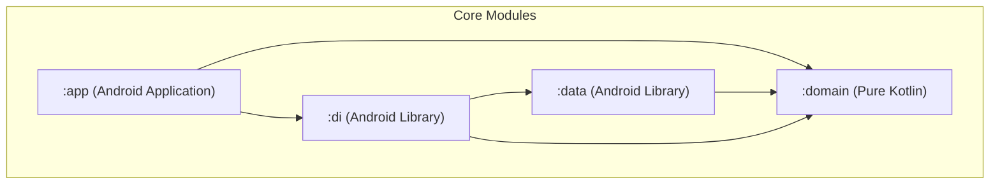

## Context

The initial setup of the Walmart Android application requires a solid foundation to scale. To ensure code maintainability, separation of concerns, and ease of testing, the project will implement Clean Architecture across four modules. The build configuration will use modern Kotlin DSL and Kotlin Symbol Processing (KSP).

## Goals / Non-Goals

**Goals:**
- Create and configure a root Gradle project with Kotlin DSL (`build.gradle.kts`) and Google KSP.
- Configure four distinct modules with strict unidirectional dependencies: `:domain`, `:data`, `:di`, and `:app`.
- Enforce that the `:domain` module contains zero Android framework dependencies (pure Kotlin).
- Integrate core dependency libraries: Dagger-Hilt, Room, Retrofit, OkHttp3, Kotlin Coroutines, and Coil.
- Set up unit and UI testing frameworks for each module.
- Create placeholder classes and directory structures for Hilt modules, Room database, and Retrofit HTTP clients.
- Define `WalmartApplication` with `@HiltAndroidApp` in `:app` and declare it in the manifest.

**Non-Goals:**
- Implement any functional business features or UI flows.
- Define concrete Room entities/DAOs or specific Retrofit service interfaces.
- Configure production CI/CD pipelines or play store release configs.

## Decisions

### 1. Kotlin DSL (`build.gradle.kts`) & Version Catalog
- **Decision:** Utilize Kotlin DSL for all Gradle build scripts and centralize dependency versions via a Gradle Version Catalog (`settings.gradle.kts` + `gradle/libs.versions.toml`).
- **Rationale:** Kotlin DSL provides compile-time checks, superior IDE auto-completion/refactoring, and a unified language ecosystem. Centrally managing dependency versions simplifies dependency upgrades and consistency across all modules.

### 2. Multi-Module Project Structure
- **Decision:** Structure the application across four core modules (`:domain`, `:data`, `:di`, `:app`) with unidirectional dependencies.
- **Rationale:** The separation isolates core business logic (`:domain`) from framework-specific details. `:app` cannot access `:data` details directly, enforcing that all UI-data binding occurs via interfaces defined in `:domain` and bound in `:di`.

### 3. Google KSP (Kotlin Symbol Processing)
- **Decision:** Configure Google KSP for annotation processing for Room and Hilt instead of KAPT.
- **Rationale:** KSP runs up to 2x faster than KAPT, provides native Kotlin parsing, and is fully recommended by Google.

### 4. Dependency Injection Framework
- **Decision:** Use Dagger-Hilt for centralized dependency injection container.
- **Rationale:** Dagger-Hilt is Google's recommended framework for Android, providing compile-time verification, life-cycle aware dependency scopes, and Jetpack Compose/ViewModel integration.

### 5. Project Generation Tool
- **Decision:** Use the Google `android` CLI tool to initialize the project skeleton.
- **Rationale:** Standardizes project structure generation using verified templates. The command `android create empty-activity --name="Walmart" --minSdk=31 --output=.` will be run from the repository root to create the starter structure.

## Risks / Trade-offs

### [Risk] Circular or illegal module dependencies
- **Description:** Developers might accidentally introduce dependencies that bypass clean boundaries (e.g. `:app` directly referencing `:data` implementation).
- **Mitigation:** Strict enforcement in the Gradle build files. `:app`'s `build.gradle.kts` will not include `project(":data")` under `dependencies`.

### [Risk] Pure Kotlin module `:domain` importing Android classes
- **Description:** Future development could mistakenly import Android views, Context, or bundles inside `:domain`.
- **Mitigation:** Ensure `:domain` is a standard Kotlin module using the `kotlin` plugin instead of `com.android.library`. The compiler will fail if any Android libraries are referenced.

### [Risk] Room compiler errors during build time
- **Description:** Schema generation or missing entities can cause compile errors with Room KSP.
- **Mitigation:** Provide minimum configuration files/placeholders and set up `room.schemaLocation` options in Gradle configurations.
